# 🌤️ Acoman Weather Display

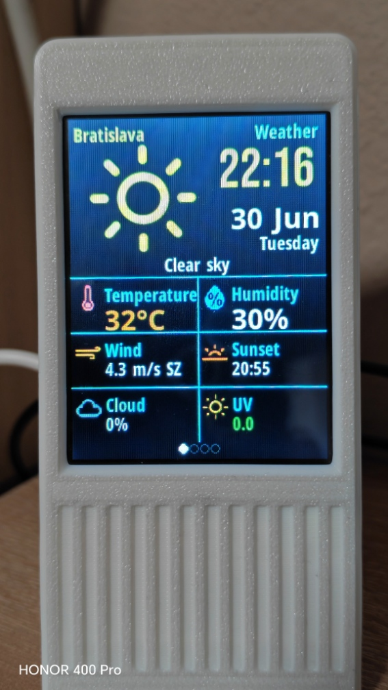

Modern ESP32 Weather Display firmware with OTA updates and a multilingual web interface.

---

## ✨ Features

- OTA firmware updates (.bin)
- Web-based configuration
- Current weather conditions
- Multi-day weather forecast
- Powered by Open-Meteo API
- Photo slideshow
- RGB LED effects
- Display brightness control
- Automatic Night Mode
- Multilingual web interface

---

## 🌍 Supported Languages

- 🇬🇧 English
- 🇸🇰 Slovak
- 🇩🇪 German
- 🇫🇷 French
- 🇪🇸 Spanish
- 🇮🇹 Italian
- 🇸🇪 Swedish
- 🇹🇷 Turkish

---

## ☁️ Weather Data

Weather data is provided by the free **Open-Meteo API**.

### Benefits

- No API key required
- Free weather service
- Current weather conditions
- Multi-day weather forecast
- Reliable weather data

https://open-meteo.com/

---

## 🔧 Supported Hardware

Currently tested only with:

- ESP32E 2.8" Display
- Resolution: 240 × 320
- LCD Driver: ST7789
- Touch Controller: RTP

**SKU:** E32R28T-1

> Other ESP32 display boards have not been tested yet and may require code modifications.

---

## 📥 Firmware

Download the latest firmware from the **Releases** section.

Future updates can be installed directly from the built-in OTA web interface.

---

## 📦 First Installation

### Requirements

- ESP32E 2.8" Display (SKU: E32R28T-1)
- USB cable
- ESP32 Flash Download Tool

### Flash addresses

| File | Address |
|------|---------|
| bootloader.bin | 0x1000 |
| partitions.bin | 0x8000 |
| boot_app0.bin | 0xE000 |
| firmware.bin | 0x10000 |

Flash Download Tool settings:

- Chip: ESP32
- Work Mode: Develop
- SPI Speed: 80 MHz
- SPI Mode: DIO
- Baud: 921600

---

## 📶 First WiFi Setup

On first boot the device creates:

SSID

```
Acoman-Setup
```

Password

```
12345678
```

Open

```
http://192.168.4.1
```

Configure your WiFi and restart the device.

---

## 🌐 Web Interface

### Home

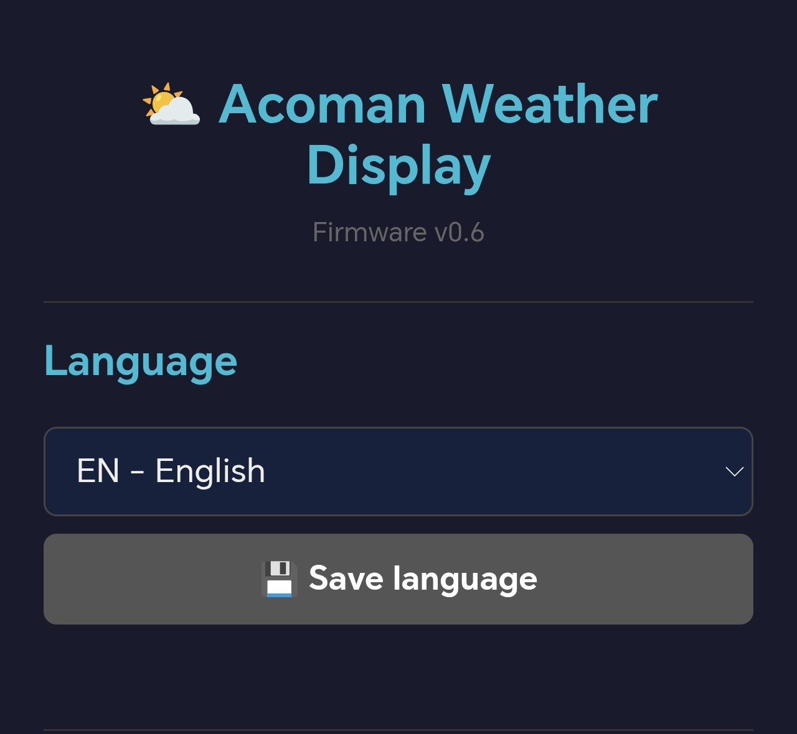

---

### Language

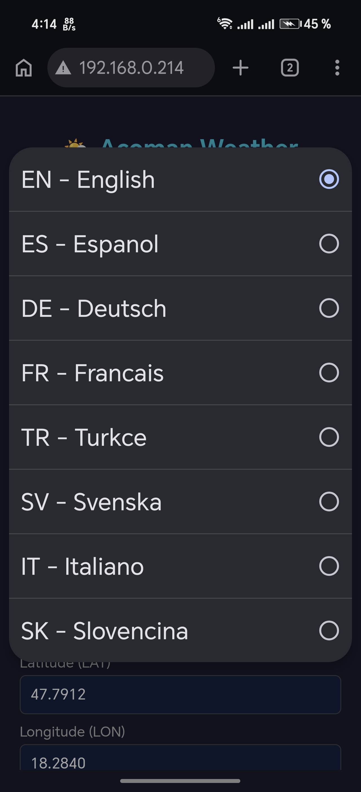

---

### Location

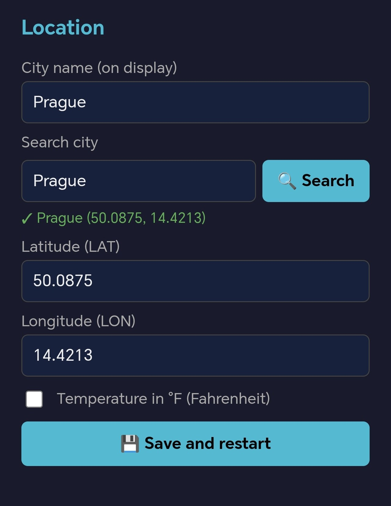

---

### Display Settings

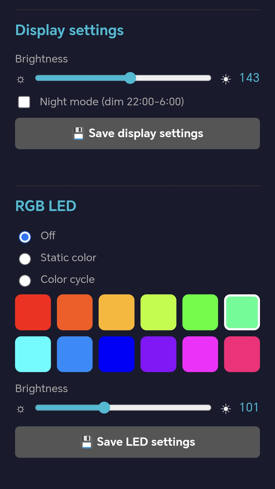

---

### Photo Manager

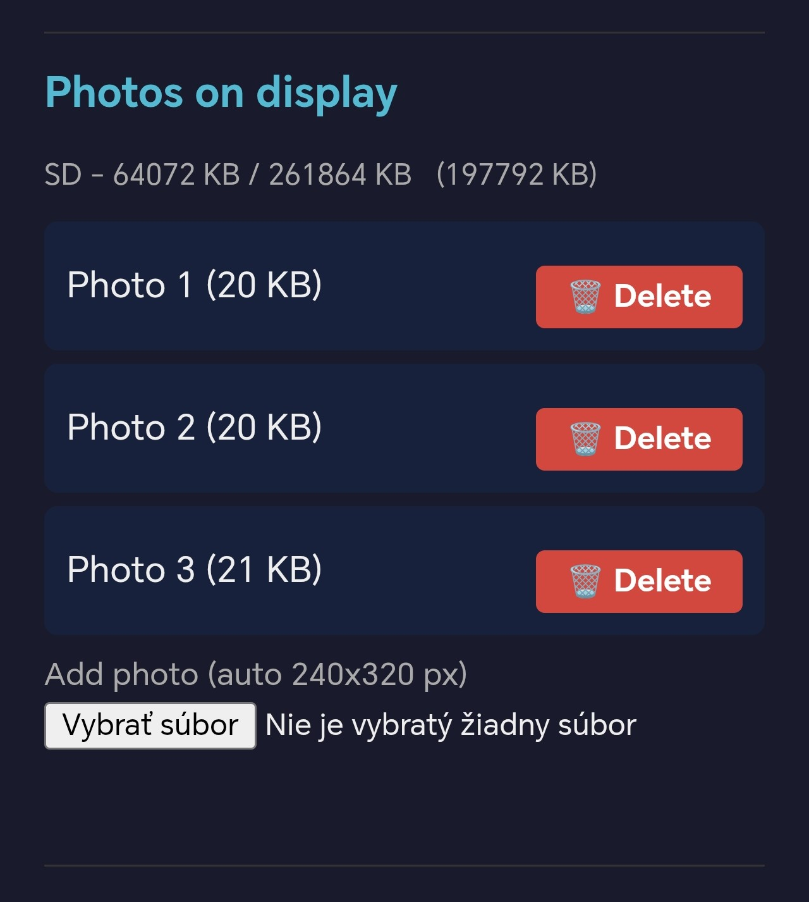

---

### Firmware Update (OTA)

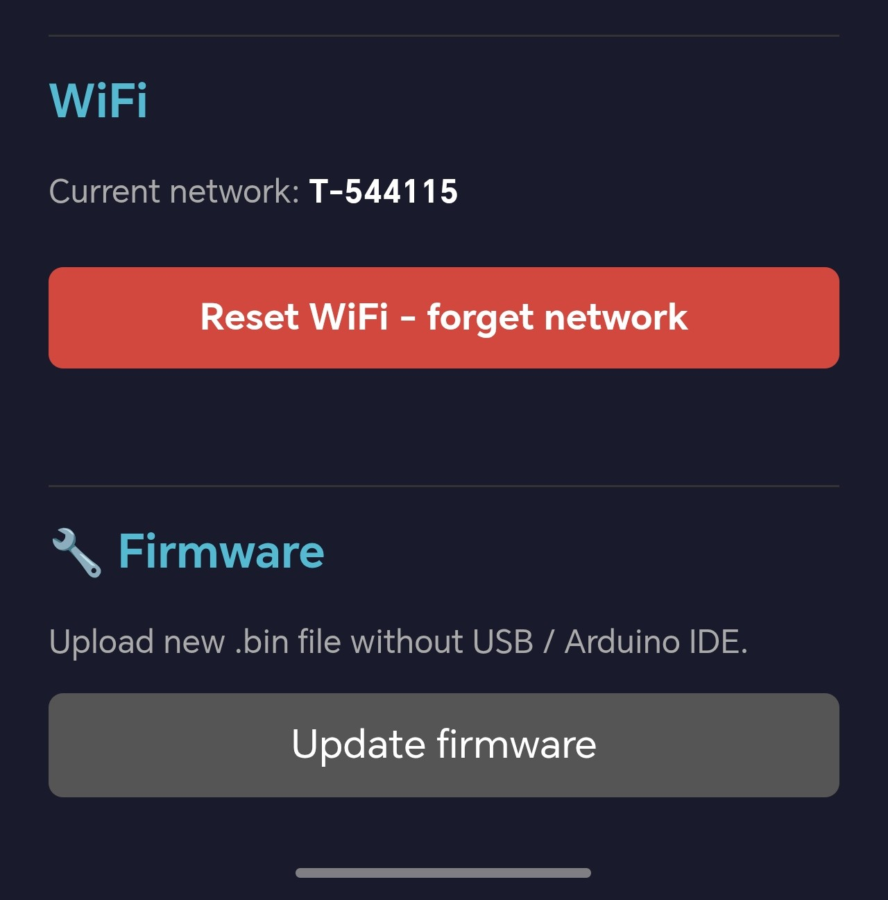

---

## 🖥️ Display Screens

### Current Weather


---

### Hourly Forecast

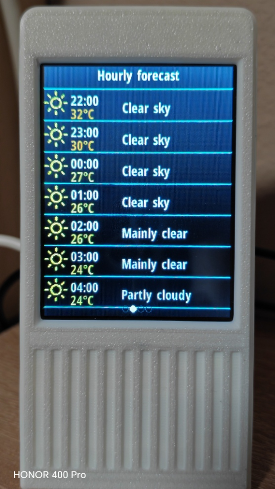

---

### 5-Day Forecast

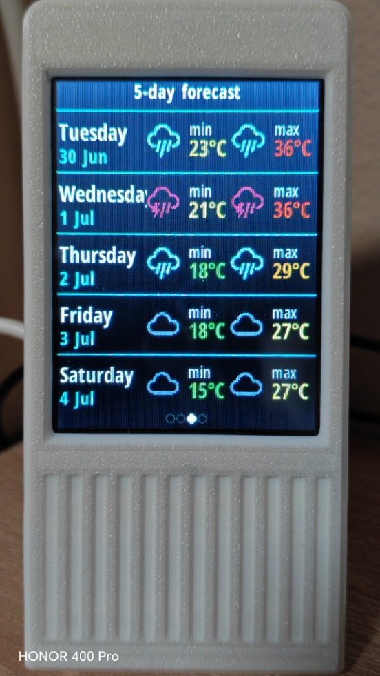

---

### Photo Slideshow

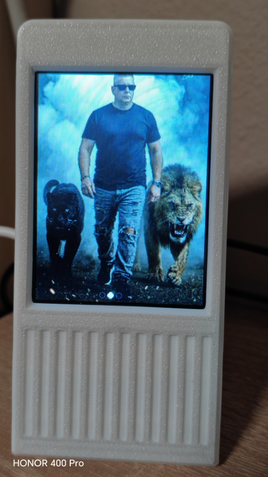

---

## 🌈 RGB LED Effects

| Green | Blue | Pink |
|-------|------|------|
| 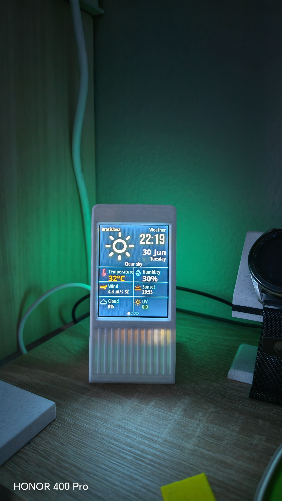 | 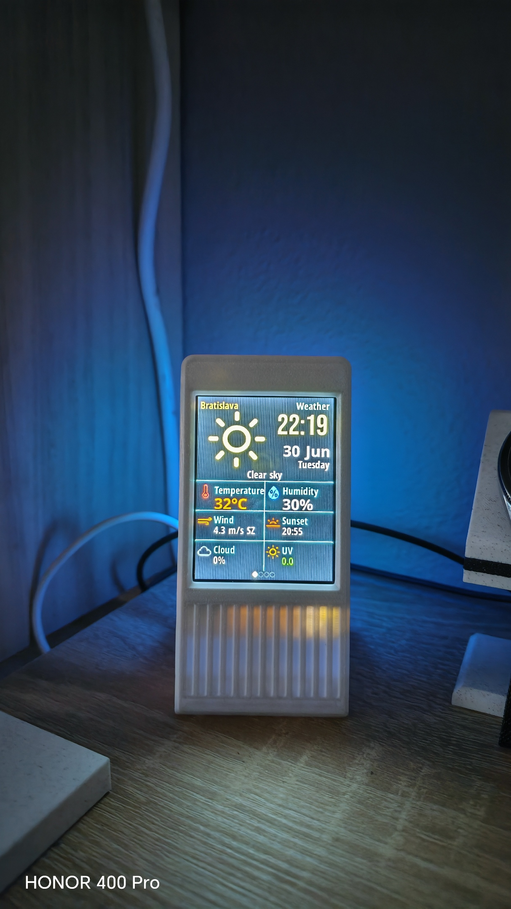 | 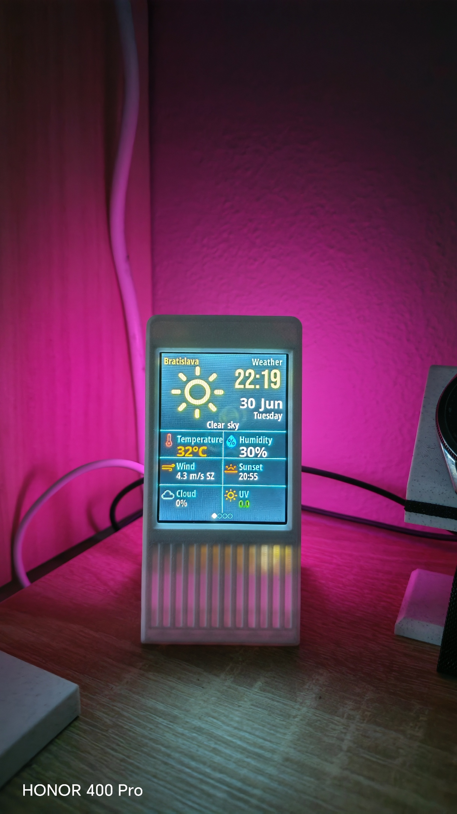 |

---

## 📖 User Guide

Complete documentation:

**User_Guide_EN.pdf**

---

## 🖨️ 3D Printed Enclosure

This repository contains firmware only.

The enclosure is **NOT included**.

Download it from MakerWorld:

https://makerworld.com/cs/models/1382304-aura-smart-weather-forecast-display

Full credit goes to the original designer.

---

## 🚀 Future Development

Planned support:

- ESP32-2432S028R
- ESP32-3248S035
- ESP32-8048S043
- ESP32-8048S070
- More display sizes
- More themes
- Additional languages
- Performance improvements
- Bug fixes

---

## ☕ Support

If you enjoy this project, you can support future development via Ko-fi.

https://ko-fi.com/acoman72

Your support helps fund:

- New ESP32 hardware
- Development
- Testing
- New firmware features
- Long-term maintenance

Thank you! ❤️

---

## 🛒 Where to Buy

Tested hardware:

**ESP32E 2.8" Display (E32R28T-1)**

- AliExpress
- Amazon
- eBay

---

## 📜 License

Copyright © 2026 Acoman72

This repository contains firmware releases and documentation.
